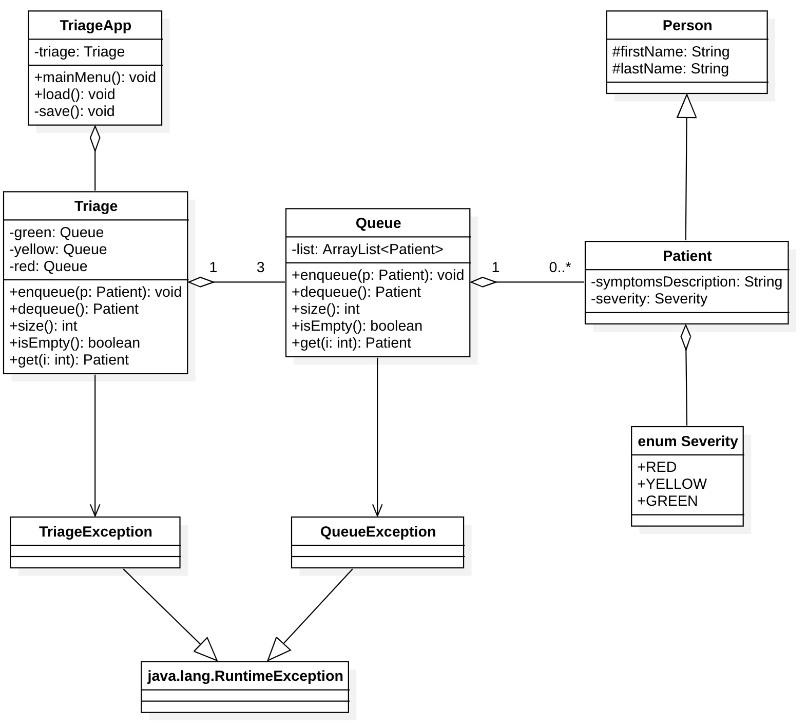
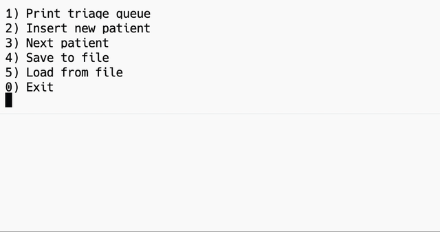

# Triage

Vogliamo realizzare il seguente progetto:



## Istruzioni

### Person e patient

`Severity`: indica la gravità del caso.

### La coda (Queue)

Una coda è una struttura dati di tipo FIFO (ovvero First In First Out). Può essere implementata in molti modi ma noi, per comodità, useremo un ArrayList. I metodi che una coda deve avere per forza sono:

* `enqueue`: aggiunge un elemento in coda
* `dequeue`: rimuove il primo elemento della coda (se c'è)

Noi, per comodità, vogliamo aggiungere anche i seguenti metodi:

* `size`
* `isEmpty`
* `get(int i)`: restituisce l'i-esimo elemento (se c'è)

### La coda con priorità (il nostro Triage)

Possiamo vedere anche questa come una coda, con gli stessi metodi di `Queue`, ma al suo interno dà priorità a secondo del codice di gravità con questo ordine: RED, YELLOW, GREEN.

### TriageApp

Deve implementare il menu e la gestione dell'input/output da console e da file:



Per cancellare lo schermo si può usare il seguente metodo:

```Java
private void clearScreen() {
  System.out.print("\033[H\033[2J");
  System.out.flush();
}
```

# Note

## Lettura da console

### Importazione della classe Scanner

Possiamo leggere da console con la classe `Scanner`. Innanzitutto, la dobbiamo importare:

```Java
import java.util.Scanner;
```

### Creazione di un oggetto Scanner

Per utilizzare la classe Scanner dobbiamo creare un oggetto `Scanner` e associarlo a una sorgente di input, nel nostro caso `System.in` che è la console:

```Java
Scanner sc = new Scanner(System.in);
```
### Lettura dell'input

Infine possiamo leggere l'input utilizzando vari metodi forniti dalla classe `Scanner`. Alcuni dei metodi più comuni sono:

* `nextInt()`: Legge un intero dalla sorgente di input.
* `nextDouble()`: Legge un numero in virgola mobile dalla sorgente di input.
* `nextLine()`: Legge una riga di testo dalla sorgente di input.
* `next()`: Legge una singola parola dalla sorgente di input.

Esempio:

```Java
int numero = sc.nextInt();
String testo = sc.nextLine();
```

### Gestione delle eccezioni

Quando si lavora con l'input dell'utente, è necessario gestire le possibili eccezioni che potrebbero verificarsi durante la lettura. Ad esempio, se l'utente inserisce un valore non valido quando ci si aspetta un intero, verrà generata un'eccezione di tipo `InputMismatchException`. Puoi gestire queste eccezioni utilizzando blocchi `try-catch`:

```Java
try {
  int numero = scanner.nextInt();
} catch (InputMismatchException e) {
  System.out.println("Inserito un valore non valido. Inserire un intero.");
}
```

### La classe TriageApp

Nella classe `TriageApp` possiamo tenere una istanza di `Scanner(System.in)` come attributo di classe. Questo vale solo per la lettura da tastiera (**se leggiamo da file è bene chiudere il file non appena abbiamo finito di leggerlo**).

```Java
public class TriageAppa {
  private Scanner sc = new Scanner(System.in);
}
```

## Scrittura su file

Per scrivere su file possiamo usare le varie classi che implementano l'interfaccia `java.io.Writer`. In particolare, in questo esempio usiamo le classi:

```Java
import java.io.FileWriter;
import java.io.PrintWriter;
```

Importiamo inoltre l'eccezione:

```Java
import java.io.IOException;
```

La classe `PrintWriter` implementa gli stessi metodi di `System.out` a cui siamo già abituati, come:

* print()
* println()
* printf()

Devo quindi aprire il file in uno speciale blocco `try-catch` detto anche `try-with-resources` e poi scriverci dentro come se scrivessi su console:

```Java
String filePath = "file.txt";

try (PrintWriter pw = new PrintWriter(new FileWriter(filePath))) {
  pw.println("Riga 1");
  pw.printf("Riga 2\n");
} catch (IOException e) {
  e.printStackTrace();
}
```

Il file viene aperto in scrittura e un eventuale file già esistente verrà sovrascritto. In ogni caso, l'operazione di scrittura può dare delle eccezioni, tutte figlie di `java.io.IOException`.

### Lettura da file

Per leggere da file possiamo utilizzare le classi:

```Java
import java.io.File;
import java.util.Scanner;
```

e dobbiamo gestire la seguente eccezione:

```Java
import java.io.FileNotFoundException;
```

Questo è un esempio di lettura da file:

```Java
String filePath = "file.txt";

try (Scanner sc = new Scanner(new File(filePath))) {
  // uso lo Scanner sc con i metodi che già conosciamo
  String line = sc.nextLine();
  int i = sc.nextInt();
  // ...
} catch (FileNotFoundException e) {
  e.printStackTrace();
}
```

Se non so quanto è lungo o come è fatto un file, posso leggerlo con un ciclo `while` e il metodo `hasNextLine()`:

```Java
String filePath = "file.txt";

try (Scanner sc = new Scanner(new File(filePath))) {
  while (sc.hasNextLine()) {
    String line = sc.nextLine();
    System.out.println(line);
  }
} catch (FileNotFoundException e) {
  e.printStackTrace();
}
```

